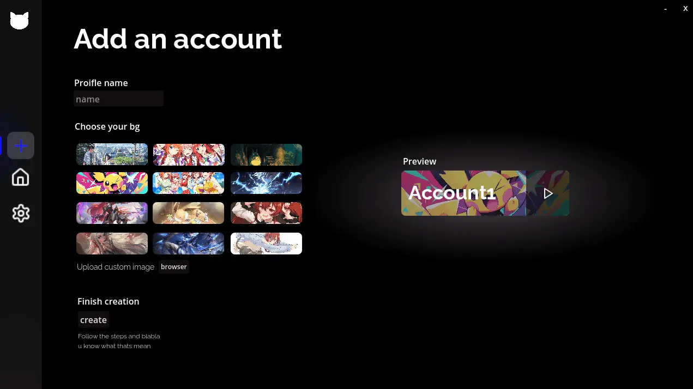

# Riot Switcher

**⚠️ IMPORTANT SECURITY NOTICE:**

**Always download Riot Switcher ONLY from the official source.**  
**Do NOT trust unknown links or unofficial websites.**  
Downloading from untrusted sources may compromise your computer's security.

🔗 Official Download: [RiotSwitcher Releases](https://github.com/arthiee4/RiotSwitcher/releases/)

---

  

  

## README Languages
- [English](#english)
- [Português](#português)
- [Español](#español)
- [Russian](#russian)
- [Chinese](#chinese)
- [Korean](#korean)

---

# English

## Riot Switcher

**Riot Switcher** is a custom launcher created for League of Legends players to manage multiple accounts in a simple, fast, and organized way.

> **Note:** Riot Switcher is currently only available for League of Legends. Valorant support is planned for future updates.

## Main Features

- Manage multiple accounts separately.
- Log in to any account with just **one click**.
- Instantly switch the game's language (voice and text). *(Feature planned for future updates)*
- Basic Vanguard core control support.

## How It Works

1. **Save Current Account:** Captures local credentials from the Riot Client.
2. **Switch Account:** Copies the selected profile to the client’s folder.
3. **Automatic Login:** Riot Client opens directly in the chosen account.
4. **Updates:** Future support for profile updates, per-account language settings, and additional integrations.

## 🧐 How to Use Riot Switcher Properly

After creating your account profile inside Riot Switcher, click on the **Play** button for the selected profile.

When the Riot Client opens:
- Log in normally.
- **IMPORTANT:** Make sure to check the **"Stay signed in"** checkbox before logging in.

If you don't check "Stay signed in," Riot Switcher won't be able to handle automatic login properly in the future.

### Quick Steps:
1. Create your account profile.
2. Click **Play**.
3. On the Riot login screen, **check "Stay signed in"** and log in.

Done! Your account is ready for one-click switching.

## Requirements

- Windows 10/11
- Installed Riot Games Client
- Administrator permissions (recommended for file copying and process management)

## Project Status

> Actively under development — currently focusing on bug fixes and new features. Future plans include Valorant integration, per-account language settings, and enhanced client management.

## How to Build the Project

The project is developed using **Godot Engine**, a powerful open-source game engine.

To build Riot Switcher:

1. **Download Godot Engine:** [Official Website](https://godotengine.org/)
2. **Open the Project:** Launch Godot, click "Import Project" and select the Riot Switcher project folder.
3. **Make Adjustments (Optional):** Modify settings or scenes if needed.
4. **Export the Build:**
   - Open **Project > Export**.
   - Add a **Windows Desktop** preset (or others if needed).
   - Click **Export Project** to generate the executable.
   - Copy and paste the **Data** folder into the same directory as the .exe.

## About Godot Engine

- **No need for external build systems** — everything is managed inside the editor.
- **Cross-platform** — easily deploy to Windows, Linux, Mac, Web, and more.
- **Lightweight builds** — small and efficient executables.
- **Active community** — continuous improvements and new features.

## License and Disclaimer

This is a personal project created for educational and organizational purposes only.

**Riot Switcher is not affiliated, associated, authorized, endorsed by, or in any way officially connected with Riot Games, Inc., or any of its subsidiaries or affiliates.**

All product and company names are trademarks™ or registered® trademarks of their respective holders. The use of these names, logos, and brands does not imply endorsement.

**Use of Riot Switcher is at your own risk. The developer does not take responsibility for any consequences, including penalties or bans, resulting from its use.**

Made with ❤️ using Godot Engine.

---

Aqui está a continuação do README com todas as línguas solicitadas:

---

# Português

## Riot Switcher

**Riot Switcher** é um launcher personalizado criado para jogadores de League of Legends gerenciarem múltiplas contas de forma simples, rápida e organizada.

> **Nota:** Riot Switcher está disponível apenas para League of Legends no momento. Suporte para Valorant está planejado para futuras atualizações.

## Principais Recursos

- Gerencie várias contas separadamente.
- Faça login em qualquer conta com apenas **um clique**.
- Mude instantaneamente o idioma do jogo (voz e texto). *(Recurso planejado para futuras atualizações)*
- Suporte básico ao controle do núcleo do Vanguard.

## Como Funciona

1. **Salvar Conta Atual:** Captura credenciais locais do Riot Client.
2. **Trocar de Conta:** Copia o perfil selecionado para a pasta do cliente.
3. **Login Automático:** O Riot Client abre diretamente na conta escolhida.
4. **Atualizações:** Futuro suporte para atualizações de perfil, configurações de idioma por conta e integrações adicionais.

## 🧐 Como Usar o Riot Switcher Corretamente

Após criar seu perfil de conta no Riot Switcher, clique no botão **Play** para o perfil selecionado.

Quando o Riot Client abrir:
- Faça login normalmente.
- **IMPORTANTE:** Certifique-se de marcar a caixa **"Manter conexão"** antes de fazer login.

Se você não marcar "Manter conexão", o Riot Switcher não conseguirá lidar com o login automático corretamente no futuro.

### Passos Rápidos:
1. Crie seu perfil de conta.
2. Clique em **Play**.
3. Na tela de login da Riot, **marque "Manter conexão"** e faça login.

Pronto! Sua conta está configurada para troca com um clique.

## Requisitos

- Windows 10/11
- Riot Games Client instalado
- Permissões de administrador (recomendado para cópia de arquivos e gerenciamento de processos)

## Status do Projeto

> Em desenvolvimento ativo - atualmente focado em correções de bugs e novos recursos. Planos futuros incluem integração com Valorant, configurações de idioma por conta e melhor gerenciamento do cliente.

## Como Compilar o Projeto

O projeto é desenvolvido usando **Godot Engine**, uma poderosa engine de jogos open-source.

Para compilar o Riot Switcher:

1. **Baixe o Godot Engine:** [Site Oficial](https://godotengine.org/)
2. **Abra o Projeto:** Inicie o Godot, clique em "Import Project" e selecione a pasta do projeto Riot Switcher.
3. **Faça Ajustes (Opcional):** Modifique configurações ou cenas se necessário.
4. **Exporte o Build:**
   - Abra **Project > Export**.
   - Adicione um preset **Windows Desktop** (ou outros se necessário).
   - Clique em **Export Project** para gerar o executável.
   - Copie e cole a pasta **Data** no mesmo diretório do .exe.

## Sobre o Godot Engine

- **Não requer sistemas de build externos** - tudo é gerenciado dentro do editor.
- **Multiplataforma** - fácil deploy para Windows, Linux, Mac, Web e mais.
- **Builds leves** - executáveis pequenos e eficientes.
- **Comunidade ativa** - melhorias contínuas e novos recursos.

## Licença e Aviso Legal

Este é um projeto pessoal criado apenas para fins educacionais e organizacionais.

**Riot Switcher não é afiliado, associado, autorizado, endossado por ou de qualquer forma oficialmente conectado com a Riot Games, Inc., ou qualquer de suas subsidiárias ou afiliadas.**

Todos os nomes de produtos e empresas são marcas™ ou marcas registradas® de seus respectivos detentores. O uso desses nomes, logos e marcas não implica endosso.

**O uso do Riot Switcher é por sua conta e risco. O desenvolvedor não se responsabiliza por quaisquer consequências, incluindo penalidades ou bans, resultantes do seu uso.**

Feito com ❤️ usando Godot Engine.

---

# Español

## Riot Switcher

**Riot Switcher** es un launcher personalizado creado para jugadores de League of Legends que permite gestionar múltiples cuentas de manera simple, rápida y organizada.

> **Nota:** Riot Switcher actualmente solo está disponible para League of Legends. El soporte para Valorant está planeado para futuras actualizaciones.

## Características Principales

- Gestiona múltiples cuentas por separado.
- Inicia sesión en cualquier cuenta con solo **un clic**.
- Cambia instantáneamente el idioma del juego (voz y texto). *(Función planeada para futuras actualizaciones)*
- Soporte básico para control del núcleo Vanguard.

## Cómo Funciona

1. **Guardar Cuenta Actual:** Captura credenciales locales del Riot Client.
2. **Cambiar de Cuenta:** Copia el perfil seleccionado a la carpeta del cliente.
3. **Inicio de Sesión Automático:** El Riot Client se abre directamente en la cuenta elegida.
4. **Actualizaciones:** Soporte futuro para actualizaciones de perfil, configuración de idioma por cuenta e integraciones adicionales.

## 🧐 Cómo Usar Riot Switcher Correctamente

Después de crear tu perfil de cuenta en Riot Switcher, haz clic en el botón **Play** para el perfil seleccionado.

Cuando se abra el Riot Client:
- Inicia sesión normalmente.
- **IMPORTANTE:** Asegúrate de marcar la casilla **"Mantener sesión iniciada"** antes de iniciar sesión.

Si no marcas "Mantener sesión iniciada", Riot Switcher no podrá manejar el inicio de sesión automático correctamente en el futuro.

### Pasos Rápidos:
1. Crea tu perfil de cuenta.
2. Haz clic en **Play**.
3. En la pantalla de inicio de sesión de Riot, **marca "Mantener sesión iniciada"** e inicia sesión.

¡Listo! Tu cuenta está configurada para cambiar con un clic.

## Requisitos

- Windows 10/11
- Riot Games Client instalado
- Permisos de administrador (recomendado para copiar archivos y gestionar procesos)

## Estado del Proyecto

> En desarrollo activo - actualmente enfocado en corrección de errores y nuevas funciones. Planes futuros incluyen integración con Valorant, configuración de idioma por cuenta y mejor gestión del cliente.

## Cómo Compilar el Proyecto

El proyecto está desarrollado usando **Godot Engine**, un potente motor de juegos open-source.

Para compilar Riot Switcher:

1. **Descarga Godot Engine:** [Sitio Oficial](https://godotengine.org/)
2. **Abre el Proyecto:** Inicia Godot, haz clic en "Import Project" y selecciona la carpeta del proyecto Riot Switcher.
3. **Realiza Ajustes (Opcional):** Modifica configuraciones o escenas si es necesario.
4. **Exporta el Build:**
   - Abre **Project > Export**.
   - Añade un preset **Windows Desktop** (u otros si es necesario).
   - Haz clic en **Export Project** para generar el ejecutable.
   - Copia y pega la carpeta **Data** en el mismo directorio que el .exe.

## Acerca de Godot Engine

- **No requiere sistemas de compilación externos** - todo se gestiona dentro del editor.
- **Multiplataforma** - fácil despliegue en Windows, Linux, Mac, Web y más.
- **Builds ligeros** - ejecutables pequeños y eficientes.
- **Comunidad activa** - mejoras continuas y nuevas funciones.

## Licencia y Aviso Legal

Este es un proyecto personal creado solo con fines educativos y organizativos.

**Riot Switcher no está afiliado, asociado, autorizado, respaldado por o de cualquier manera conectado oficialmente con Riot Games, Inc., o cualquiera de sus subsidiarias o afiliadas.**

Todos los nombres de productos y empresas son marcas™ o marcas registradas® de sus respectivos dueños. El uso de estos nombres, logos y marcas no implica respaldo.

**El uso de Riot Switcher es bajo tu propio riesgo. El desarrollador no se hace responsable de ninguna consecuencia, incluyendo sanciones o bans, resultantes de su uso.**

Hecho con ❤️ usando Godot Engine.

---

# Russian

## Riot Switcher

**Riot Switcher** — это пользовательский лаунчер, созданный для игроков League of Legends, позволяющий управлять несколькими аккаунтами просто, быстро и организованно.

> **Примечание:** В настоящее время Riot Switcher доступен только для League of Legends. Поддержка Valorant планируется в будущих обновлениях.

## Основные функции

- Управление несколькими аккаунтами отдельно.
- Вход в любой аккаунт **одним кликом**.
- Мгновенное изменение языка игры (голос и текст). *(Запланировано в будущих обновлениях)*
- Базовая поддержка управления ядром Vanguard.

## Как это работает

1. **Сохранить текущий аккаунт:** Захватывает локальные учетные данные из Riot Client.
2. **Сменить аккаунт:** Копирует выбранный профиль в папку клиента.
3. **Автоматический вход:** Riot Client открывается непосредственно в выбранном аккаунте.
4. **Обновления:** В будущем — поддержка обновлений профиля, настройки языка для каждого аккаунта и дополнительные интеграции.

## 🧐 Как правильно использовать Riot Switcher

После создания профиля аккаунта в Riot Switcher нажмите кнопку **Play** для выбранного профиля.

Когда откроется Riot Client:
- Войдите как обычно.
- **ВАЖНО:** Убедитесь, что отметили галочку **"Оставаться в системе"** перед входом.

Если не отметить "Оставаться в системе", Riot Switcher не сможет правильно обрабатывать автоматический вход в будущем.

### Быстрые шаги:
1. Создайте профиль аккаунта.
2. Нажмите **Play**.
3. На экране входа Riot **отметьте "Оставаться в системе"** и войдите.

Готово! Ваш аккаунт настроен для переключения в один клик.

## Требования

- Windows 10/11
- Установленный Riot Games Client
- Права администратора (рекомендуется для копирования файлов и управления процессами)

## Статус проекта

> Активно разрабатывается — в настоящее время сосредоточен на исправлении ошибок и новых функциях. В планах — интеграция с Valorant, настройки языка для каждого аккаунта и улучшенное управление клиентом.

## Как собрать проект

Проект разработан с использованием **Godot Engine**, мощного движка с открытым исходным кодом.

Чтобы собрать Riot Switcher:

1. **Скачайте Godot Engine:** [Официальный сайт](https://godotengine.org/)
2. **Откройте проект:** Запустите Godot, нажмите "Import Project" и выберите папку проекта Riot Switcher.
3. **Внесите изменения (опционально):** При необходимости измените настройки или сцены.
4. **Экспортируйте сборку:**
   - Откройте **Project > Export**.
   - Добавьте preset **Windows Desktop** (или другие при необходимости).
   - Нажмите **Export Project** для создания исполняемого файла.
   - Скопируйте и вставьте папку **Data** в тот же каталог, что и .exe.

## О Godot Engine

- **Не требует внешних систем сборки** — все управляется внутри редактора.
- **Кроссплатформенность** — легкое развертывание на Windows, Linux, Mac, Web и других.
- **Легкие сборки** — компактные и эффективные исполняемые файлы.
- **Активное сообщество** — постоянные улучшения и новые функции.

## Лицензия и отказ от ответственности

Это личный проект, созданный только в образовательных и организационных целях.

**Riot Switcher не связан, не аффилирован, не авторизован, не одобрен и никак не связан официально с Riot Games, Inc. или любыми ее дочерними компаниями.**

Все названия продуктов и компаний являются товарными знаками™ или зарегистрированными® товарными знаками их владельцев. Использование этих названий, логотипов и брендов не подразумевает одобрения.

**Использование Riot Switcher осуществляется на ваш страх и риск. Разработчик не несет ответственности за любые последствия, включая штрафы или баны, возникшие в результате его использования.**

Сделано с ❤️ на Godot Engine.

---

# Chinese

## Riot Switcher

**Riot Switcher** 是一款为《英雄联盟》玩家定制的启动器，可简单、快速、有序地管理多个账号。

> **注意：** Riot Switcher 目前仅支持《英雄联盟》。未来更新计划加入《Valorant》支持。

## 主要功能

- 分别管理多个账号。
- **一键登录** 任意账号。
- 即时切换游戏语言（语音和文字）。 *(未来更新计划)*
- 基本 Vanguard 核心控制支持。

## 工作原理

1. **保存当前账号：** 从 Riot 客户端获取本地凭据。
2. **切换账号：** 将选定配置文件复制到客户端文件夹。
3. **自动登录：** Riot 客户端直接打开选定账号。
4. **更新：** 未来支持配置文件更新、单账号语言设置及其他集成功能。

## 🧐 如何正确使用 Riot Switcher

在 Riot Switcher 中创建账号配置文件后，点击所选配置文件的 **Play** 按钮。

当 Riot 客户端打开时：
- 正常登录。
- **重要：** 登录前务必勾选 **"保持登录状态"** 复选框。

如未勾选"保持登录状态"，Riot Switcher 将来可能无法正确处理自动登录。

### 快速步骤：
1. 创建账号配置文件。
2. 点击 **Play**。
3. 在 Riot 登录界面，**勾选"保持登录状态"** 并登录。

完成！您的账号已设置为一键切换。

## 系统要求

- Windows 10/11
- 已安装 Riot Games 客户端
- 管理员权限（推荐用于文件复制和进程管理）

## 项目状态

> 积极开发中 — 目前专注于错误修复和新功能。未来计划包括《Valorant》集成、单账号语言设置和增强的客户端管理。

## 如何构建项目

本项目使用 **Godot Engine** 开发，这是一个强大的开源游戏引擎。

构建 Riot Switcher：

1. **下载 Godot Engine:** [官方网站](https://godotengine.org/)
2. **打开项目：** 启动 Godot，点击"Import Project"并选择 Riot Switcher 项目文件夹。
3. **调整（可选）：** 根据需要修改设置或场景。
4. **导出构建：**
   - 打开 **Project > Export**。
   - 添加 **Windows Desktop** 预设（或其他所需预设）。
   - 点击 **Export Project** 生成可执行文件。
   - 将 **Data** 文件夹复制到与 .exe 相同的目录中。

## 关于 Godot Engine

- **无需外部构建系统** — 一切均在编辑器内管理。
- **跨平台** — 轻松部署至 Windows、Linux、Mac、Web 等平台。
- **轻量构建** — 小巧高效的可执行文件。
- **活跃社区** — 持续改进和新功能。

## 许可证与免责声明

这是一个仅用于教育和组织目的的个人项目。

**Riot Switcher 与 Riot Games, Inc. 或其任何子公司或附属机构无隶属、关联、授权、认可关系，亦非正式连接。**

所有产品和公司名称均为其各自持有人的商标™或注册商标®。使用这些名称、徽标和品牌并不意味着认可。

**使用 Riot Switcher 风险自负。开发者不对因使用而产生的任何后果（包括处罚或封禁）负责。**

使用 Godot Engine 制作，充满 ❤️。

---

# Korean

## Riot Switcher

**Riot Switcher**는 리그 오브 레전드 플레이어를 위해 만들어진 커스텀 런처로, 여러 계정을 간단하고 빠르며 체계적으로 관리할 수 있습니다.

> **참고:** Riot Switcher는 현재 리그 오브 레전드만 지원합니다. 발로란트 지원은 향후 업데이트 예정입니다.

## 주요 기능

- 여러 계정을 별도로 관리합니다.
- **한 번의 클릭**으로 어떤 계정이든 로그인할 수 있습니다.
- 게임 언어(음성 및 텍스트)를 즉시 전환합니다. *(향후 업데이트 예정 기능)*
- 기본 Vanguard 코어 제어 지원.

## 작동 방식

1. **현재 계정 저장:** Riot 클라이언트에서 로컬 자격 증명을 캡처합니다.
2. **계정 전환:** 선택한 프로필을 클라이언트 폴더에 복사합니다.
3. **자동 로그인:** Riot 클라이언트가 선택한 계정으로 직접 열립니다.
4. **업데이트:** 향후 프로필 업데이트, 계정별 언어 설정 및 추가 통합 지원 예정.

## 🧐 Riot Switcher 올바르게 사용하는 방법

Riot Switcher 내에서 계정 프로필을 생성한 후, 선택한 프로필의 **Play** 버튼을 클릭하세요.

Riot 클라이언트가 열리면:
- 정상적으로 로그인합니다.
- **중요:** 로그인 전 **"로그인 상태 유지"** 확인란을 선택하세요.

"로그인 상태 유지"를 선택하지 않으면 Riot Switcher가 향후 자동 로그인을 제대로 처리하지 못할 수 있습니다.

### 빠른 단계:
1. 계정 프로필을 생성하세요.
2. **Play**를 클릭하세요.
3. Riot 로그인 화면에서 **"로그인 상태 유지"를 선택**하고 로그인하세요.

완료! 계정이 한 번의 클릭으로 전환할 수 있도록 설정되었습니다.

## 요구 사항

- Windows 10/11
- 설치된 Riot Games 클라이언트
- 관리자 권한 (파일 복사 및 프로세스 관리 권장)

## 프로젝트 상태

> 활발히 개발 중 — 현재 버그 수정 및 새로운 기능에 집중 중. 향후 계획에는 발로란트 통합, 계정별 언어 설정 및 향상된 클라이언트 관리가 포함됩니다.

## 프로젝트 빌드 방법

이 프로젝트는 강력한 오픈 소스 게임 엔진인 **Godot Engine**을 사용하여 개발되었습니다.

Riot Switcher를 빌드하려면:

1. **Godot Engine 다운로드:** [공식 웹사이트](https://godotengine.org/)
2. **프로젝트 열기:** Godot를 실행하고 "Import Project"를 클릭한 후 Riot Switcher 프로젝트 폴더를 선택하세요.
3. **조정 (선택 사항):** 필요한 경우 설정 또는 장면을 수정하세요.
4. **빌드 내보내기:**
   - **Project > Export**를 엽니다.
   - **Windows Desktop** 프리셋을 추가합니다 (필요한 경우 다른 프리셋도 가능).
   - **Export Project**를 클릭하여 실행 파일을 생성합니다.
   - **Data** 폴더를 .exe와 같은 디렉터리에 복사하여 붙여넣습니다.

## Godot Engine 정보

- **외부 빌드 시스템 불필요** — 모든 것이 편집기 내에서 관리됩니다.
- **크로스 플랫폼** — Windows, Linux, Mac, Web 등에 쉽게 배포할 수 있습니다.
- **경량 빌드** — 작고 효율적인 실행 파일.
- **활발한 커뮤니티** — 지속적인 개선 및 새로운 기능.

## 라이선스 및 면책 조항

이 프로젝트는 교육 및 조직 목적으로만 제작된 개인 프로젝트입니다.

**Riot Switcher는 Riot Games, Inc. 또는 그 자회사 및 계열사와 제휴, 연계, 승인, 보증되지 않았으며 공식적으로 연결되어 있지 않습니다.**

모든 제품 및 회사 이름은 해당 소유자의 상표™ 또는 등록 상표®입니다. 이러한 이름, 로고 및 브랜드의 사용은 보증을 의미하지 않습니다.

**Riot Switcher 사용은 사용자의 책임 하에 있습니다. 개발자는 사용으로 인한 결과(제재 또는 계정 정지 포함)에 대해 책임을 지지 않습니다.**

Godot Engine으로 ❤️을 담아 제작했습니다.

--- 
