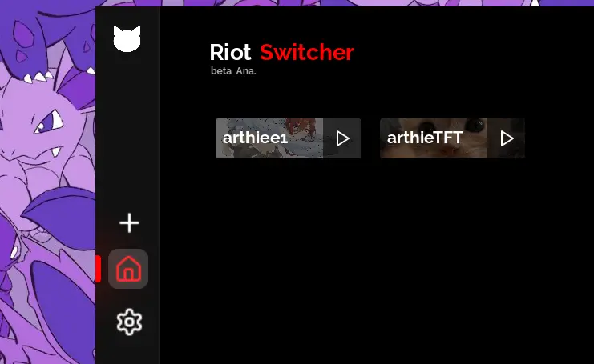
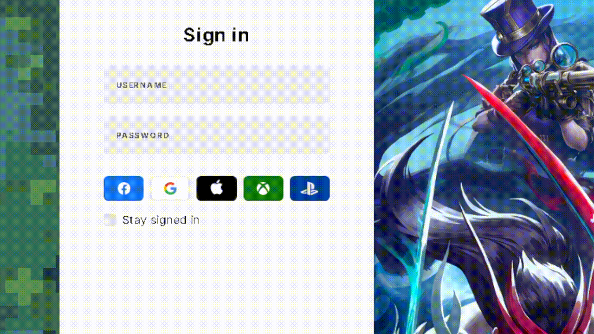

# Riot Switcher

**IMPORTANT SECURITY NOTICE**

Always download Riot Switcher from the official source only. Do not trust unknown links or unofficial websites. Downloading from untrusted sources may compromise your computer's security.

---

  

## What is Riot Switcher

A custom launcher for League of Legends that makes managing multiple accounts simple. It stores the login session of each account and switches between them in one click.

Only League of Legends is supported for now. Valorant support is planned for future updates.

## How It Works

Each account lives in its own profile with its own session files. When you launch a profile, Riot Switcher swaps the Riot Client session to that account and opens the client already signed in.

## How to Use

Create a profile and log in once on the Riot Client with "Stay signed in" checked. From then on, just press play on the profile you want.

  

**IMPORTANT:** always check "Stay signed in" on the Riot login screen. Without it, automatic login will not work.

## Building

Open the project in the Godot editor. The Catui Builder addon adds a panel at the bottom of the editor: pick the engine modules you want and press Build. The result is a lightweight Godot template used to export Riot Switcher.

## AI Usage

Generative AI is strictly prohibited. AI assisted tools are allowed for development tasks such as research, debugging, documentation and code assistance. Contributions must always be understood, reviewed and maintained by the person submitting them. Be efficient, but not dumb. Vibe coded contributions are not accepted.

## License and Disclaimer

This is a personal project created for educational and organizational purposes only.

Riot Switcher is not affiliated, associated, authorized, endorsed by, or in any way officially connected with Riot Games, Inc., or any of its subsidiaries or affiliates.

All product and company names are trademarks or registered trademarks of their respective holders. The use of these names and brands does not imply endorsement.

Use of Riot Switcher is at your own risk. The developer is not responsible for any consequences, including penalties or bans, resulting from its use.

Made with Godot Engine.
