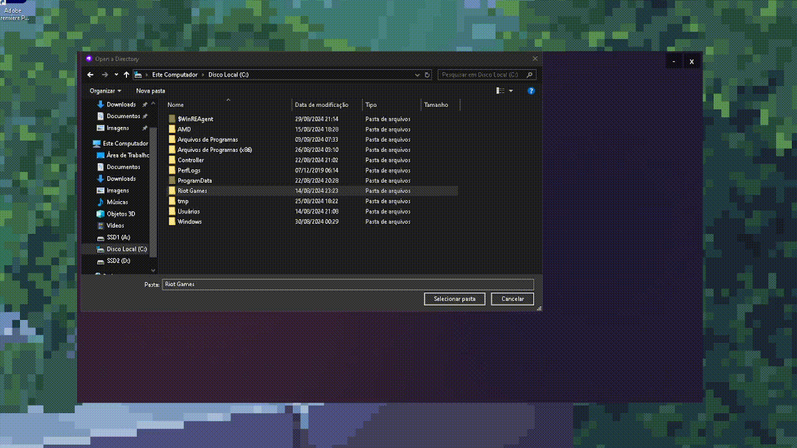

# RiotSwitcher

**LeagueSwitcher** is a streamlined and user-friendly application designed to effortlessly manage and switch between multiple Riot accounts. Say goodbye to the hassle of logging in and out repeatedly—LeagueSwitcher makes accessing your accounts a breeze, so you can focus on what really matters: enjoying your games. Perfect for players with multiple profiles, this app is your go-to solution for seamless account management.

---

**A new look!**

---

You can manage profiles, each with a different Riot account, a unique name, and an icon (more customization support coming in the future; it's currently in alpha).

You can launch your game more efficiently, always running it from the root, which also helps avoid various client bugs by ensuring a clean start every time

---
# A fast guide

At the start, look for the Riot Client folder, go inside, and confirm to ensure everything works perfectly.

After creating the profile, please wait for the client to initialize.
ps: remember the most important step -> when logging in for the first time, ALWAYS click "Stay Signed In." Don’t forget!, after that, just log in and wait for the game to start.

After these steps and once your account is logged in, go back to the switcher and press the 'Already Logged in' button, and that's it! Your profile will be saved, and you should follow the same process for all the others profiles. So, you'll be able to log into any of them with just one click! <3

**Please note:** LeagueSwitcher is currently in **alpha**. While we're excited to share it with you, it's still in the early stages of development. Expect regular updates and improvements as we work towards a stable release.

---
